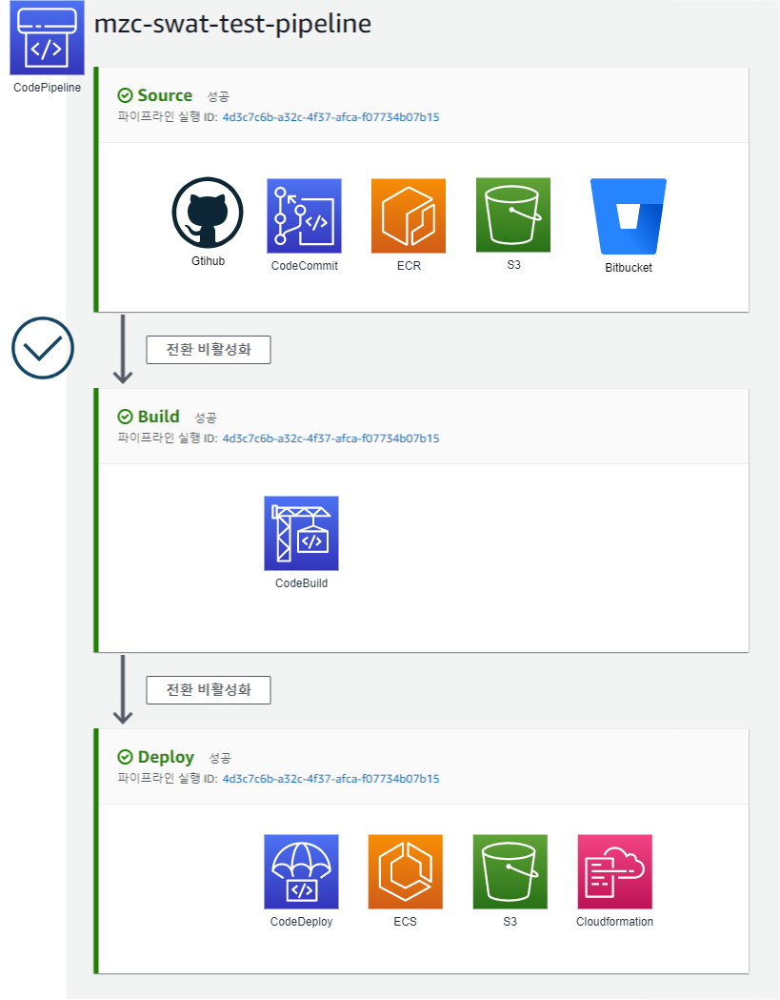

# CodePipeline
AWS CodePipeline을 Terraform으로 관리하기 위한 코드

## 지원
- Source - (Approval) - Build - (Deploy) 로 구성되어 있다.  
- 승인(Approval)과 배포(Deploy) 단계는 선택할 수 있다.   
- 소스(Source)는 CodeCommit, Bitbucket, GitHub, GitHub Enterpise Server, S3, ECR을 지원한다.   
- 배포(Deploy)는 S3, CloudFormation, CodeDeploy, ECS를 지원한다.  

## 구성



## 설치
```
# Init
terraform Init 

# Apply
terraform apply -var-file=env/dev.tfvars
```

## Requirements

| Name | Version |
|------|---------|
| <a name="requirement_terraform"></a> [terraform](#requirement\_terraform) | >= 1.3.0, < 2.0.0 |

## Providers

| Name | Version |
|------|---------|
| aws | ~> 4.4.0 |
| random | ~> 3.1.0 |

## Modules

| Name | Source |
|------|--------|
| codebuild | ./modules/codebuild |
| codepipeline | ./modules/codepipeline |

## Resources

| Name | Type |
|------|------|
| [aws_s3_bucket.codepipeline_bucket](https://registry.terraform.io/providers/hashicorp/kubernetes/latest/docs/resources/config_map) | resource |
| [aws_s3_bucket_acl.codepipeline_bucket_acl](https://registry.terraform.io/providers/hashicorp/kubernetes/latest/docs/resources/config_map) | resource |


## Inputs
| Name | Description | Type | Default | Required |
|------|-------------|------|---------|:--------:|
| project | 프로젝트 이름 | `string` | `""` | yes |
| region | AWS 리전 정보 (e.g. ap-northeast-2) | `string` | `""` | yes |
| env | tag 생성을 위한 입력 값 (e.g. dev, stg, ...) | `string` | `""` | yes |
| codepipeline_bucket_name | codepipeline artifact bucket | `string` | `""` | yes |
| provider | source provider `Bitbucket`, `S3`, `ECR`, `CodeCommit`, `GitHub`, `GithubEnterpriseServer` 입력 후 source block 내부 해당 configuration을 세팅합니다. | `string` | `""` | yes |

---
[링크](https://docs.aws.amazon.com/codepipeline/latest/userguide/action-reference.html)
