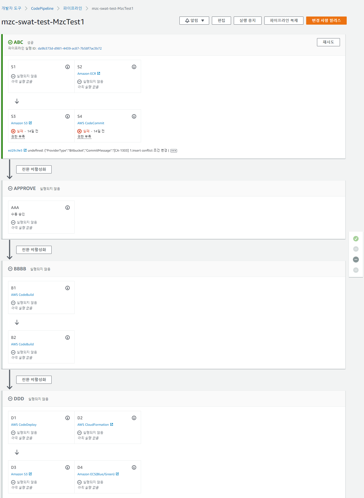

# CodePipeline
AWS CodePipeline을 Terraform으로 관리하기 위한 코드


## 구성



## 설치
```
# Init
terraform init 

# Apply
terraform apply -var-file=env/dev.tfvars
```

## Requirements

| Name | Version |
|------|---------|
| terraform | >= 1.3.0, < 2.0.0 |

## Providers

| Name | Version |
|------|---------|
| aws | ~> 4.4.0 |
| random | ~> 3.1.0 |

## Modules

| Name | Source |
|------|--------|
| codebuild | ./modules/codebuild |
| codepipeline | ./modules/codepipeline |

## Resources

| Name | Type |
|------|------|
| [aws_s3_bucket.codepipeline_bucket](https://registry.terraform.io/providers/hashicorp/aws/latest/docs/resources/s3_bucket) | resource |
| [aws_s3_bucket_acl.codepipeline_bucket_acl](https://registry.terraform.io/providers/hashicorp/aws/latest/docs/resources/s3_bucket_acl) | resource |


## Inputs
| Name | Description | Type | Default | Required |
|------|-------------|------|---------|:--------:|
| project | 프로젝트 이름 | `string` | `""` | yes |
| region | AWS 리전 정보 (e.g. ap-northeast-2) | `string` | `""` | yes |
| env | tag 생성을 위한 입력 값 (e.g. dev, stg, ...) | `string` | `""` | yes |
| codepipeline_bucket_name | codepipeline artifact bucket | `string` | `""` | yes |
| default_tags | tag | `map(string)` | `{}` | no |

---
[링크](https://docs.aws.amazon.com/codepipeline/latest/userguide/action-reference.html)
